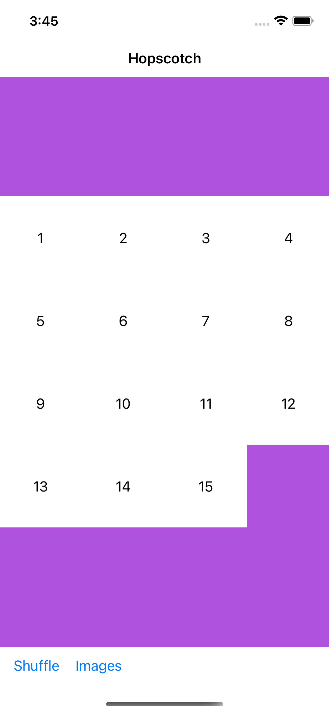

# 15 puzzle UI using Swift

The user shouldbe able to move blocks into the blank space to tryand solve the puzzle. You can use the language of your choice to implement the solution.It should behave like a physical puzzle in that you can push an entire row over into the blankspace. (i.e. in the example below, you could pushall of row 1 over from the 15 square).You do not need to ensure that the puzzle is solvable or provide a solver for it.

## 

## Installation
- open Hopscotch.xcworkproj. 
 - Select the iphone simulator & run it.

## Requirements

- iOS 14.0
- Xcode 12
- Swift 5

## Features
###  A Number Tile Puzzle

### An image Tile Puzzle

### Buttons for switching to images or numbers.

### Button to solve the puzzle or shuffle the tiles.

- XCTestCase for UITesting.

## Design Pattern: Model-View-ViewModel (MVVM)
is a structural design pattern that separates objects into three distinct groups:
- #### Models 
  - hold application data. They’re usually structs or simple classes.
- #### Views 
  - display visual elements and controls on the screen. They’re typically subclasses of UIView.
- #### View models
  - transform model information into values that can be displayed on a view. They’re usually classes, so they can be passed around as references.
  
  
  ## Improvements / Need to be done
  
- Improve some UX / UI designs and components.
- Write full test coverages or unit tests for BoardView and FifteenBoard.

## Technology / Tools Used
- UIKit - UIView
- Programmaticlly UI
- MVVM
- XCTestCase for unit tests and UI Tests.
- Xcode Instruments for memory leaks and allocations.

## Demo

